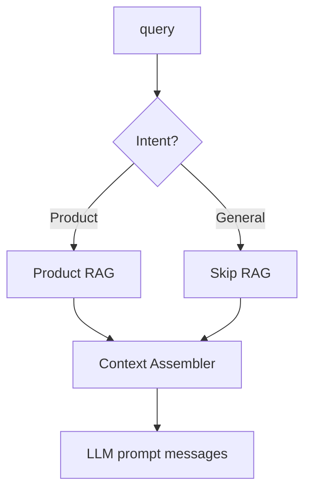

# 営業相談チャット プロンプト設計案 v1

## 目的

`Message.for_openai` を置き換え、相談内容に応じて製品RAGを柔軟に参照しながら、的確で高速な営業支援レスポンスを返すためのプロンプトとメソッドを定義する。

## 想定インプット

| パラメータ | 型 | 必須 | 説明 |
| --- | --- | --- | --- |
| `product_id` | string | ✔ | 対象プロダクトID。RAG用インデックス解決などに利用 |
| `messages` | Message[] | ✔ | 過去のチャット履歴（role, content など） |
| `query` | string | ✔ | 相談者の最新入力。RAGへの問い合わせキーワードにも使用 |

## 新メソッド案 `ChatPromptBuilder.build(args)`

### 出力

- OpenAI / Anthropic などへ渡す `messages` 形式。最上位に system、続いて context/user/assistant の時系列履歴を並べる。

### フロー概要

1. **インテント推定**
   - `classify_intent(query, messages)` を実装し、`GENERAL` / `PRODUCT` に分類。
   - 軽量LLMまたはルール（例: 「料金」「機能」「商材」などのキーワード）で高速判定。
2. **RAGコンテキスト収集**
   - `needs_product?` なら `ProductRag.fetch(product_id, query)` を実行し、`document_rag_sample.json` と同様に `candidates[].content.parts[].text` を取り出し 2,000～3,000 文字程度に要約。
3. **プロンプト生成**
   - `SystemPromptBuilder` で固定の口調・制約を定義。
   - `ContextAssembler` が取得済み RAG テキストを `## Product Knowledge` セクションに整形。
   - 既存 `messages` を `HistoryFormatter` で role 変換（user→`User`, assistant→`Sales AI` 等）。
4. **最終メッセージ配列**
   - `[system, context, history..., latest_user]` で返却。context は assistant role でも systemでも可だが、OpenAI GPT-4o 系なら system 2段構成で安定。



## プロンプト骨子

````text
System:
あなたは礼儀正しく信頼できるB2B営業アシスタントです。事実ベースで回答し、
- 推測は避け、根拠のない数値は出さない
- 不明点は率直に伝える
- 依頼がなければ個別製品の価格・契約条件は disclose しない
- 同僚や顧客を尊重した敬語で回答する

Assistant (context):
## Product Knowledge
{product_context_or "製品RAGからの情報はありません。"}

## 会話履歴
{formatted_history}

ユーザーからの最新相談:
{query}

回答指針:
1. 相談の意図を要約してから助言する
2. 製品情報を参照した箇所は簡潔に根拠を示す
3. 次のアクション案を1～2個提示する
```
````

## RAGレスポンス処理

- `document_rag_sample.json` フォーマットを基準に `candidates[].content.parts[].text` を全文結合。
- 長文は `ContextCompressor` で箇条書き3～5項目に要約（LLMまたはクラシック要約アルゴ）。
- 各項目へ `source_id` を付けてログに残し、回答生成後に参照箇所を追跡できるようにする。

## 実装上の補足

- 失敗時のフォールバック: RAG取得に失敗したらエラーメッセージを埋め込まず、「現在参照できる製品情報がありません」と明示。
- キャッシュ: 同じ `product_id` ＋ `query`（後方数トークン）でのRAG結果を短期キャッシュして速度最適化。
- オブザーバビリティ: `intent`, `rag_hits`, `prompt_tokens` を構造化ログに出す。回答品質トリアージに必須。
- ユニットテスト: 各 Intent の分岐や RAGレスポンス欠損時の文面などをモックで検証。

以上を `ChatPromptBuilder.build` に実装することで、問い合わせ内容に応じた最適なコンテキスト注入と丁寧な営業回答を両立できる。 
