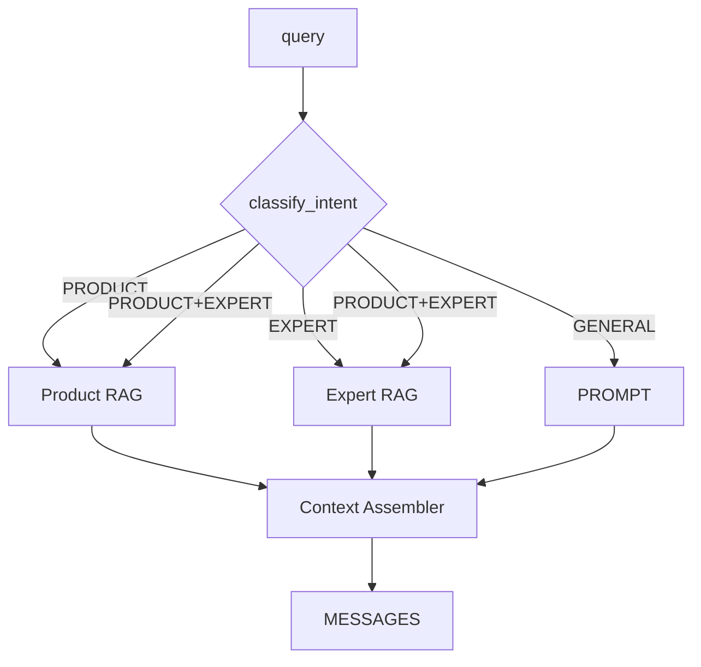

# 営業相談チャット プロンプト設計案 v2

## 目的

`ChatPromptBuilder.build` を v1 から拡張し、製品RAGに加えて先輩営業RAG（以下 Expert RAG）も活用できる柔軟なプロンプト生成を実現する。相談内容に応じて製品知識・先輩営業トーク・汎用助言を適切に切り替え、`Message.for_openai` の完全な代替を目指す。

## 想定インプット

| パラメータ | 型 | 必須 | 説明 |
| --- | --- | --- | --- |
| `product_id` | string | ✔ | 対象プロダクトID。Product RAG のインデックス解決に使用 |
| `sales_expert_id` | string |  | 参照したい先輩営業ID。未指定で Expert intent の場合は相談相手指定を再依頼 |
| `messages` | Message[] | ✔ | 過去チャット履歴 |
| `query` | string | ✔ | 最新ユーザー入力。Intent 判定と RAG クエリに使用 |
| `context_opts` | Hash |  | RAG取得上限、キャッシュキー、LLM種別などのオプション |

## `ChatPromptBuilder.build(args)` v2 フロー

1. **インテント推定**
   - `classify_intent(query, messages)` が `GENERAL` / `PRODUCT` / `EXPERT` / `PRODUCT_AND_EXPERT` を返す。
   - `sales_expert_id` が未指定かつ Expert を含む Intent の場合、`needs_expert_selection?` を true にして後段プロンプトへ誘導文を差し込む。
2. **RAGフェッチ**
   - `needs_product?` なら既存の `ProductRag.fetch(product_id, query)` を実行し、2,000～3,000 文字程度の要約に圧縮。
   - `needs_expert?` なら `ExpertRag.fetch(product_id, sales_expert_id, query)` を呼び出し、先輩営業の実際の応答やTipsを 3～5 個の要点に整理。`sales_expert_id` が無い場合は実行しない。
   - RAGレスポンスは `source_id`・`score` を保持してログに示す。
3. **プロンプト生成**
   - `SystemPromptBuilder` で一貫した敬語・事実ベース指針を定義。
   - `ContextAssembler` が `## Product Knowledge` と `## Expert Advice` の 2 セクションを構築。未取得時はそれぞれ既定の欠損メッセージを入れる。
   - `HistoryFormatter` が既存履歴を `User`/`Sales AI` 表記へ正規化。
   - Expert 指定が必須だが `sales_expert_id` が無い場合は、最新ユーザー発話の直前に「希望する先輩営業を指定してください」といったユーザー向けフラグメントを埋め込む。
4. **メッセージ配列返却**
   - `[system, assistant_context, history..., latest_user]` 構成。context メッセージ内に Product / Expert / 会話履歴 / 最新相談 / 回答指針を含める。



## プロンプト骨子

````text
System:
あなたは礼儀正しく信頼できるB2B営業アシスタントです。事実ベースで回答し、
- 推測や根拠のない数値は出さない
- 不明点は率直に伝える
- 依頼がない限り機密性の高い金額・契約条件は開示しない
- 同僚や顧客を尊重した敬語でコミュニケーションする

Assistant (context):
## Product Knowledge
{product_context || "製品RAGからの情報はありません。"}

## Expert Advice ({sales_expert_name || "先輩営業未指定"})
{expert_context || "参照可能な先輩営業のトークデータがありません。"}

## 会話履歴
{formatted_history}

ユーザーからの最新相談:
{query}

回答指針:
1. 相談の意図を一文で要約してから助言する
2. 製品/先輩営業データを参照した箇所は根拠を簡潔に示す
3. 次のアクション（例: ユーザーヒアリング、社内確認）を1～2個提案する
4. 先輩営業が必要だが指定されていない場合は、候補を確認してから回答する
```
````

## Expert指向クエリの扱い

- `sales_expert_id` 未指定で Expert intent の場合
  - 最新ユーザーメッセージ前に `Assistant (context)` で「どの先輩営業に相談したいか」を尋ねる誘導を含め、LLM回答でもまず確認するよう促す。
  - Event ログには `expert_status: "pending_selection"` を記録。
- 指定済みだが RAG が空の場合
  - `expert_context` に「指定先輩の会話ログを参照できませんでした。別の先輩に切り替えるか製品情報のみで回答してください。」を入れる。

## RAGレスポンス処理詳細

- Product / Expert それぞれで `ContextCompressor` を呼び、箇条書き 3～5 項に圧縮。
- Expert RAG では「状況」「トーク例」「留意点」などのラベルを付けて抽出。
- 双方に `source_id` を付与し、回答側が引用できるよう `context_metadata` へ格納。

## 実装補足

- キャッシュ: `product_id + normalized(query_tail)` と `sales_expert_id + query_tail` で別々に短期キャッシュ。
- ロギング: `intent`, `needs_product`, `needs_expert`, `rag_hits_product`, `rag_hits_expert`, `prompt_tokens` を JSON で出力。
- テスト: intent 分岐、欠損時誘導、両RAG併用時のセクション順序、Expert未指定時の動作をモックで網羅。
- フェイルセーフ: どちらの RAG も取得できない場合は GENERAL プロンプトとして最低限の助言を返す。

この v2 設計により、先輩営業RAGが実装された際に即座にプロンプトへ組み込み、ユーザー意図に合わせた高度な営業支援を提供できる。
